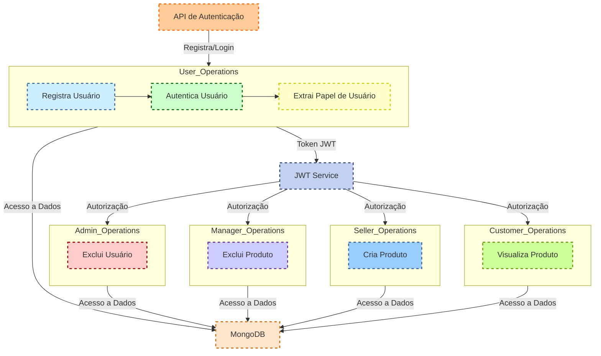

# API E-commerce - Documentação

Este repositório contém uma API de e-commerce desenvolvida em Spring Boot, que oferece funcionalidades de autenticação segura usando tokens JWT e controle de acesso baseado em papéis de usuário. Abaixo está uma visão detalhada da estrutura, funcionalidades principais e como utilizar a API.

---

## Estrutura do Projeto

O projeto está estruturado nos seguintes pacotes principais:

- **`com.example.Api_Ecomerce.application`**: Contém a classe principal `ApiEcomerceApplication` que inicializa a aplicação Spring Boot.
- **`com.example.Api_Ecomerce.config`**: Configurações de segurança (`SecurityConfig`) utilizando Spring Security para definir autorizações e autenticações.
- **`com.example.Api_Ecomerce.controller`**: Controladores REST que definem os endpoints da API e integram com o serviço (`UserService`).
- **`com.example.Api_Ecomerce.model`**: Modelos de dados, como `UserEntity`, representando entidades de usuário.
- **`com.example.Api_Ecomerce.repository`**: Pacote destinado para futuras implementações de repositórios de dados.
- **`com.example.Api_Ecomerce.security`**: Utilitários de segurança, incluindo a classe `JwtUtil` para geração e validação de tokens JWT.

---

## Funcionalidades Principais

1. **Autenticação e Autorização**
   - **POST `/login`**: Endpoint para autenticar usuários. Retorna um token JWT necessário para acessar recursos protegidos.
   - **GET `/nomeusuario/{token}`**: Endpoint para extrair o nome de usuário a partir de um token JWT.

2. **Endpoints Protegidos**
   - **GET `/gerente/{token}`**: Acesso restrito a usuários com papel GERENTE.
   - **GET `/admin/{token}`**: Acesso restrito a usuários com papel ADMIN.

3. **Configuração de Segurança**
   - Utiliza Spring Security para configurar políticas de segurança baseadas em papéis de usuário.
   - Senhas são armazenadas de forma segura utilizando BCryptPasswordEncoder.

---

## Uso da API

1. **Execução**
   - Inicie a aplicação executando a classe `ApiEcomerceApplication`.

2. **Autenticação**
   - Para autenticar um usuário, envie uma requisição POST para `/login` com um corpo JSON contendo o nome de usuário e senha.

   Exemplo de Requisição:
   ```json
   POST /login
   {
       "nome": "gabriel",
       "senha": "1"
   }
Acesso a Recursos Protegidos

Utilize o token JWT recebido para acessar os endpoints protegidos, como /gerente/{token} e /admin/{token}.
Exemplo de Requisição:

http
Copiar código
GET /gerente/{token}
Authorization: Bearer <token_jwt>
Exemplo de Integração
Para integrar esta API em seu projeto, siga os passos acima para autenticar usuários e acessar os recursos protegidos conforme necessário.

Considerações Finais
Este projeto demonstra uma implementação robusta de segurança com Spring Boot e Spring Security, oferecendo autenticação via tokens JWT e controle de acesso baseado em papéis de usuário de forma eficaz.

Para mais detalhes e personalizações, consulte o código-fonte e os comentários nos arquivos relevantes.

Esta documentação fornece uma visão abrangente da API de e-commerce desenvolvida, destacando seus principais recursos, funcionalidades e instruções básicas para utilização e integração.

# Aqui veremos exemplos funcionais da aplicação utilizando o insomnia.
- Aqui temos a validação dos usuarios exemplo: Admin.

# Aqui a geração do token JWT validado.


# Abaixo segue um diagrama de funcionamento.
- Ele serve para descrever a funcionalidade da api para facil entendimento.

